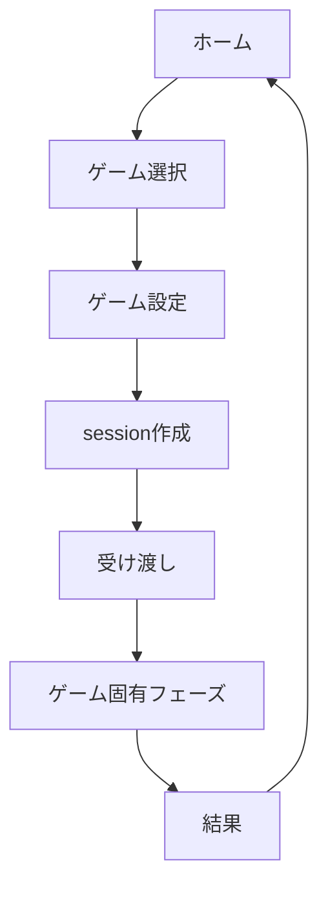
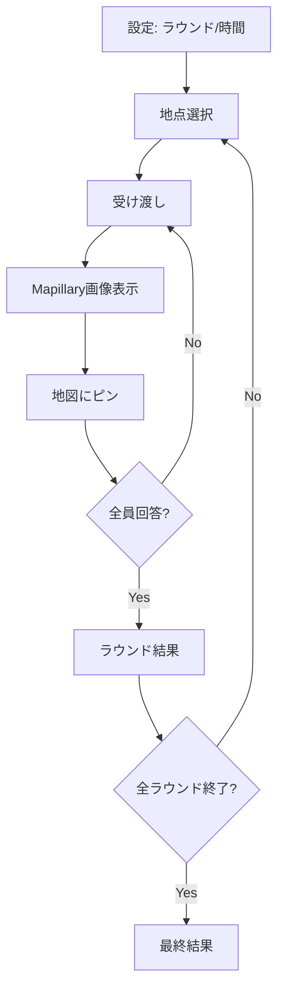
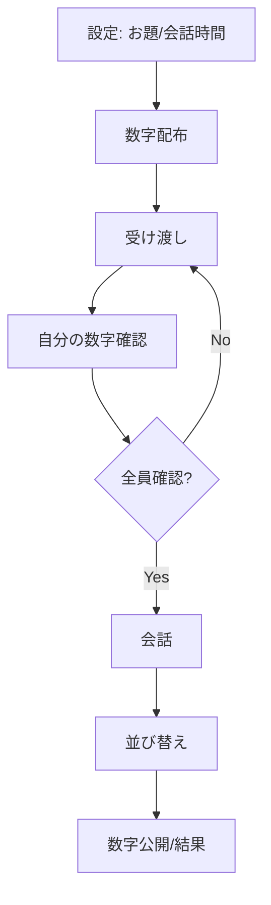
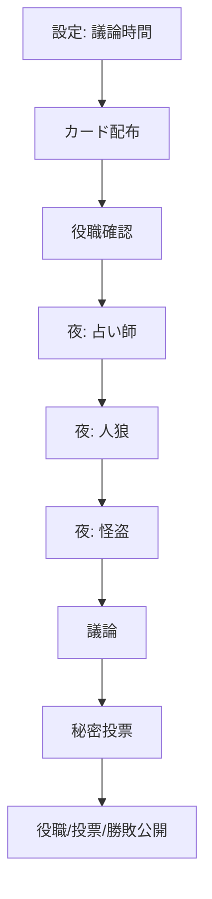
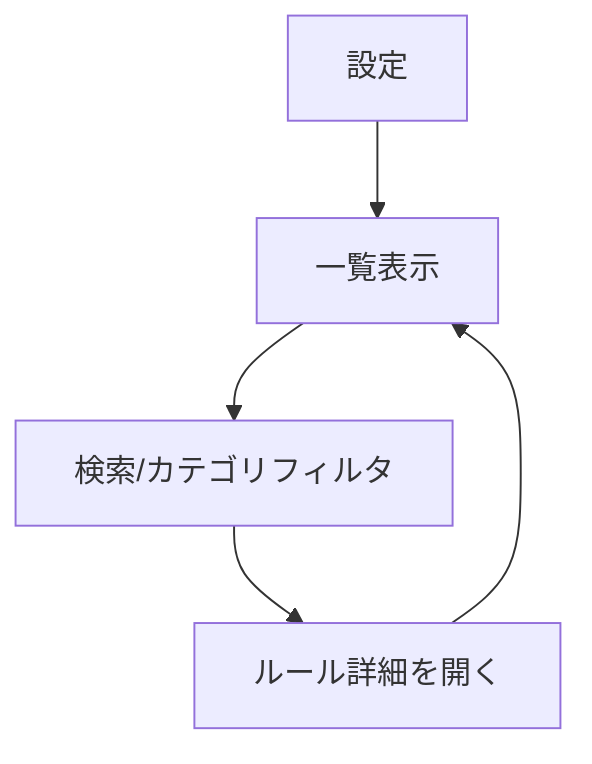

# Unit単位システム設計

## 目的

スマホ1台を回して遊ぶブラウザ向けパーティゲーム集を、ゲーム追加しやすく、ゲーム同士が干渉しない構造で実装する。

初期ゲーム:

- 日本マップ当て
- ナンバートーク
- ワンナイト人狼
- 飲み会ゲーム辞典

## 設計原則

- アカウント、ログイン、個人情報保存は持たない。
- 共通機能とゲーム固有ロジックを分ける。
- 各ゲームは `gameId` を持つ独立unitとして登録する。
- 共通unitは特定ゲームを import しない。
- ゲーム固有unitは他ゲームのstate、型、UIを参照しない。
- 保存データは `gameId` と `sessionId` で名前空間を分ける。
- 秘密情報表示中、回答中、投票中、受け渡し中は広告を出さない。

## 推奨技術構成

- Frontend: React + TypeScript
- Build: Vite または Next.js static export
- State: gameごとの reducer/state machine
- Storage: localStorageから開始、必要に応じてIndexedDB
- PWA: service workerでアプリshellをキャッシュ
- Map: MapLibre GL または Leaflet
- Street image: Mapillary JS/API

## ディレクトリ案

```txt
src/
  app/
    AppShell.tsx
    routes.ts
    screens/
      HomeScreen.tsx
      PlayerSetupScreen.tsx
      GameSetupScreen.tsx
      PassDeviceScreen.tsx
  core/
    game-registry/
    player/
    session/
    storage/
    navigation/
    ads/
    timer/
    random/
    analytics/
    ui/
  games/
    geo-guessr/
      definition.ts
      types.ts
      state.ts
      screens/
      units/
    number-talk/
      definition.ts
      types.ts
      state.ts
      screens/
      units/
    onenight-werewolf/
      definition.ts
      types.ts
      state.ts
      screens/
      units/
    drinking-games/
      definition.ts
      types.ts
      state.ts
      screens/
      units/
  data/
    geo-locations/
    number-talk-topics/
    werewolf-roles/
    drinking-games/
```

## 共通Unit

### U-COM-001 AppShell Unit

責務:

- アプリ全体のレイアウトを提供する。
- 現在の画面を表示する。
- 共通ヘッダー、戻る、プレイヤー設定導線を提供する。

入力:

- currentRoute
- currentSession
- registeredGames

出力:

- 表示するscreen
- navigationイベント

依存してよいunit:

- GameRegistry
- Navigation
- PlayerProfile
- AdPolicy

依存禁止:

- 各ゲームの内部state
- 各ゲームの役職、数字、地点などの固有データ

### U-COM-002 GameRegistry Unit

責務:

- ゲーム定義を登録する。
- ホーム画面に必要なゲームタイトル、内容、参加人数を返す。
- `gameId` から対象ゲームのsetup/session/screen定義を解決する。

主な型:

```ts
type GameDefinition = {
  gameId: string;
  title: string;
  description: string;
  minPlayers: number;
  maxPlayers: number;
  createInitialState: (input: NewGameInput) => unknown;
  getInitialRoute: () => GameRoute;
  canShowAds: (state: unknown) => boolean;
};
```

依存してよいunit:

- なし。登録されるだけの薄いunitにする。

依存禁止:

- storage
- UI component
- 他ゲームdefinition

### U-COM-003 PlayerProfile Unit

責務:

- ニックネームと担当色を管理する。
- 2から8人の制約を検証する。
- 同一セッション内で識別できる `playerId` を発行する。

主な型:

```ts
type Player = {
  id: string;
  nickname: string;
  color: string;
};
```

保存:

- `party:v1:players`

依存してよいunit:

- Storage
- RandomId

依存禁止:

- ゲーム固有state

### U-COM-004 Session Unit

責務:

- 1回のゲームプレイを `sessionId` で管理する。
- 共通情報とゲーム固有情報を分離する。
- 新規開始、再開、終了を扱う。

主な型:

```ts
type GameSession<TGameState> = {
  sessionId: string;
  gameId: string;
  players: Player[];
  createdAt: string;
  status: "setup" | "playing" | "result" | "completed";
  gameState: TGameState;
};
```

保存:

- `party:v1:sessions:{sessionId}:meta`
- `party:v1:sessions:{sessionId}:game:{gameId}`

依存してよいunit:

- Storage
- GameRegistry

依存禁止:

- 他ゲームstate

### U-COM-005 PassDevice Unit

責務:

- スマホ受け渡し画面を提供する。
- 次のプレイヤー名だけを表示する。
- 秘密情報や前プレイヤーの回答を表示しない。

入力:

- nextPlayer
- nextRoute
- label

出力:

- `confirmHandoff`

依存してよいunit:

- PlayerProfile
- Navigation

依存禁止:

- 秘密情報の中身
- 前プレイヤーの回答内容

### U-COM-006 Navigation Unit

責務:

- 画面遷移を管理する。
- 設定画面、受け渡し画面、ゲーム画面、結果画面の戻る導線を制御する。
- ブラウザバック時に秘密情報が再表示されないよう、必要に応じて受け渡し画面へ戻す。

依存してよいunit:

- Session

依存禁止:

- ゲーム固有ロジック

### U-COM-007 Storage Unit

責務:

- localStorage/IndexedDBへの保存、読み込み、削除を抽象化する。
- schemaVersionを持つ。
- 壊れた保存データを破棄または初期化する。

主な型:

```ts
type PersistedEnvelope<T> = {
  schemaVersion: 1;
  savedAt: string;
  data: T;
};
```

依存してよいunit:

- なし

依存禁止:

- UI
- ゲーム固有処理

### U-COM-008 AdPolicy Unit

責務:

- 現在画面で広告を表示してよいか判定する。
- 共通禁止フェーズを管理する。
- ゲーム固有の `canShowAds` と合成する。

広告表示可:

- ホーム
- プレイヤー設定
- ゲーム設定
- ラウンド結果
- 最終結果

広告表示不可:

- 受け渡し
- 秘密情報表示
- Guessr回答中
- 投票中
- 夜行動中

依存してよいunit:

- GameRegistry
- Session

依存禁止:

- 広告SDK固有処理をゲームunitに漏らすこと

### U-COM-009 Timer Unit

責務:

- 制限時間、議論時間、残り時間を管理する。
- 一時停止、再開、終了イベントを提供する。

利用ゲーム:

- Guessr回答時間
- ナンバートーク会話時間
- ワンナイト人狼議論時間

### U-COM-010 Random Unit

責務:

- shuffle、sample、seeded randomを提供する。
- 再現性が必要な場合はseedをsessionに保存する。

利用ゲーム:

- Guessr地点選択
- ナンバートーク数字配布
- ワンナイト人狼カード配布

## 画面Unit

### U-SCR-001 HomeScreen Unit

表示内容:

- ゲームタイトル
- ゲーム内容
- 参加人数
- プレイヤー設定ボタン

表示しない内容:

- 目安時間
- 細かいゲームタグ
- Guessrのデッキや移動設定

### U-SCR-002 PlayerSetupScreen Unit

責務:

- プレイヤー追加、削除、名前変更、色変更を扱う。
- 最大8人、最小2人をUIで制約する。

### U-SCR-003 GameSetupScreen Unit

責務:

- 選択ゲームの設定項目だけを表示する。
- 戻るボタンでホームへ戻れる。

ゲーム別設定:

- Guessr: ラウンド数、制限時間
- ナンバートーク: お題カテゴリ、会話時間
- ワンナイト人狼: 議論時間

### U-SCR-004 ResultScreen Unit

責務:

- ゲームごとの結果を表示する。
- 同じ設定でもう一度遊ぶ。
- ホームへ戻る。

## 日本マップ当て Unit

### U-GEO-001 GeoGameDefinition Unit

責務:

- `gameId = "geo-guessr"` としてGameRegistryへ登録する。
- 対応人数、説明、初期state生成、広告可否を提供する。

対応人数:

- 2から8人

### U-GEO-002 GeoSetup Unit

責務:

- ラウンド数と制限時間だけを設定する。
- デッキ選択、移動設定は表示しない。

主な型:

```ts
type GeoConfig = {
  rounds: 3 | 5;
  timeLimitSec: 0 | 30 | 60 | 90;
  movementMode: "no-move";
};
```

### U-GEO-003 GeoLocationRepository Unit

責務:

- 運営側で管理するMapillary地点データを返す。
- 無効化された地点を出題対象から除外する。
- ユーザーには地点一覧やデッキを見せない。

主な型:

```ts
type GeoLocation = {
  id: string;
  mapillaryImageId: string;
  lat: number;
  lng: number;
  heading?: number;
  region?: string;
  difficulty?: "easy" | "normal" | "hard";
  tags: string[];
  enabled: boolean;
};
```

依存してよいunit:

- Storageまたはstatic data loader

依存禁止:

- UI
- GameSessionの内部処理

### U-GEO-004 MapillaryProvider Unit

責務:

- Mapillary画像表示に必要なデータを取得する。
- Mapillary固有のAPI responseをアプリ内部型へ変換する。
- attribution表示に必要な情報を返す。
- 画像取得失敗時にエラー種別を返す。

主な型:

```ts
type StreetImage = {
  provider: "mapillary";
  imageId: string;
  lat: number;
  lng: number;
  imageUrl?: string;
  attribution: string;
};
```

依存してよいunit:

- Network client

依存禁止:

- Geo scoring
- PlayerProfile

### U-GEO-005 GeoRoundStateMachine Unit

責務:

- ラウンド進行を管理する。
- 全員に同じ地点を出題する。
- 各プレイヤー回答後に受け渡しへ戻す。

状態:

```ts
type GeoPhase =
  | "roundIntro"
  | "handoff"
  | "viewingImage"
  | "placingPin"
  | "roundResult"
  | "gameResult";
```

### U-GEO-006 GeoAnswerMap Unit

責務:

- 日本地図を表示する。
- 回答ピンを置く、置き直す、確定する。
- 回答確定後は編集不可にする。

依存してよいunit:

- Map UI library

依存禁止:

- MapillaryProvider
- Scoring formulaの詳細

### U-GEO-007 GeoScoring Unit

責務:

- 正解地点と回答地点の距離を計算する。
- 点数を計算する。

主な型:

```ts
type GeoAnswer = {
  playerId: string;
  roundIndex: number;
  guessLat: number;
  guessLng: number;
  distanceMeters: number;
  score: number;
};
```

### U-GEO-008 GeoResult Unit

責務:

- ラウンド結果と総合結果を生成する。
- 正解地点、全員のピン、距離、点数を表示用に整形する。

## ナンバートーク Unit

### U-ITO-001 NumberTalkGameDefinition Unit

責務:

- `gameId = "number-talk"` としてGameRegistryへ登録する。
- 対応人数、説明、初期state生成、広告可否を提供する。

対応人数:

- 2から8人

### U-ITO-002 NumberTalkSetup Unit

責務:

- お題カテゴリと会話時間を設定する。
- 数字範囲は1から100固定。
- 手札は1人1枚固定。

主な型:

```ts
type NumberTalkConfig = {
  numberMin: 1;
  numberMax: 100;
  cardsPerPlayer: 1;
  topicCategory: "normal" | "twist" | "love";
  discussionTimeSec: 180 | 300;
};
```

### U-ITO-003 TopicRepository Unit

責務:

- お題カテゴリからお題を返す。
- お題文をオリジナル文言として管理する。

主な型:

```ts
type NumberTalkTopic = {
  id: string;
  category: string;
  text: string;
  lowHint?: string;
  highHint?: string;
  enabled: boolean;
};
```

### U-ITO-004 NumberDealer Unit

責務:

- 1から100の重複しない数字を各プレイヤーに1枚配る。
- 配布結果は秘密情報として扱う。

主な型:

```ts
type NumberAssignment = {
  playerId: string;
  number: number;
};
```

### U-ITO-005 NumberRevealTurn Unit

責務:

- プレイヤーごとに自分の数字だけを表示する。
- 表示後は受け渡し画面へ戻す。

広告:

- 表示不可

### U-ITO-006 Discussion Unit

責務:

- お題と会話タイマーを表示する。
- 数字そのものは表示しない。

### U-ITO-007 OrderBoard Unit

責務:

- プレイヤーを推定順に並べ替える。
- 公開前に確定確認をする。

### U-ITO-008 NumberTalkJudge Unit

責務:

- 公開された順番が昇順か判定する。
- 結果表示用に全員の数字を返す。

## ワンナイト人狼 Unit

### U-WOLF-001 WerewolfGameDefinition Unit

責務:

- `gameId = "onenight-werewolf"` としてGameRegistryへ登録する。
- 対応人数、説明、初期state生成、広告可否を提供する。

対応人数:

- 3から8人

注意:

- 公式名称、役職名、説明文、UI表現をそのまま使う場合は権利確認または許諾取得を前提にする。

### U-WOLF-002 RoleCatalog Unit

責務:

- 役職定義を管理する。
- 初期役職は村人、人狼、占い師、怪盗。
- 表示文言は差し替え可能にする。

主な型:

```ts
type RoleId = "villager" | "werewolf" | "seer" | "robber";

type RoleDefinition = {
  roleId: RoleId;
  name: string;
  team: "human" | "werewolf" | "variable";
  nightOrder: number | null;
  description: string;
};
```

### U-WOLF-003 RoleSetBuilder Unit

責務:

- プレイヤー数+2枚のカードセットを作る。
- 基本セットを構成する。

初期構成:

- 人狼2枚
- 占い師1枚
- 怪盗1枚
- 残りは村人

例:

- 3人: 5枚 = 人狼2、占い師1、怪盗1、村人1
- 4人: 6枚 = 人狼2、占い師1、怪盗1、村人2
- 5人: 7枚 = 人狼2、占い師1、怪盗1、村人3

### U-WOLF-004 CardDealer Unit

責務:

- カードセットをシャッフルする。
- 各プレイヤーに1枚ずつ配る。
- 残り2枚を中央カードとして保持する。

主な型:

```ts
type WerewolfCards = {
  playerCards: Record<string, RoleId>;
  centerCards: [RoleId, RoleId];
  currentCards: Record<string, RoleId>;
};
```

### U-WOLF-005 RoleRevealTurn Unit

責務:

- プレイヤーごとに自分の初期役職だけを表示する。
- 表示後は受け渡し画面へ戻す。

広告:

- 表示不可

### U-WOLF-006 NightActionStateMachine Unit

責務:

- 夜行動を占い師、人狼、怪盗の順に進める。
- 行動結果を必要なプレイヤーにだけ表示する。
- 行動のない役職でも同じ受け渡し体験を維持する。

状態:

```ts
type WerewolfNightPhase =
  | "seerAction"
  | "werewolfAction"
  | "robberAction"
  | "nightComplete";
```

### U-WOLF-007 SeerAction Unit

責務:

- 占い師が他プレイヤー1人、または中央カード2枚を確認する。
- 結果を占い師本人にだけ表示する。

### U-WOLF-008 WerewolfAction Unit

責務:

- 人狼が他の人狼を確認する。
- 1人狼の場合は単独であることを表示する。

### U-WOLF-009 RobberAction Unit

責務:

- 怪盗が自分と他プレイヤー1人のカードを交換する。
- 交換後の自分の役職だけを確認する。
- 相手には交換結果を表示しない。

### U-WOLF-010 Discussion Unit

責務:

- 議論タイマーを表示する。
- 役職や夜行動結果は自動公開しない。

### U-WOLF-011 Vote Unit

責務:

- 各プレイヤーが秘密投票する。
- プレイヤーまたは平和村に投票できる。
- 全員投票後に結果へ進む。

主な型:

```ts
type WerewolfVote = {
  fromPlayerId: string;
  target: { type: "player"; playerId: string } | { type: "peace" };
};
```

### U-WOLF-012 WerewolfJudge Unit

責務:

- 最多得票者を判定する。
- 勝利陣営を判定する。

初期判定ルール:

- 最多得票者に人狼が含まれる場合、人間チーム勝利。
- 最多得票者が人間のみの場合、人狼チーム勝利。
- 全員の投票が分散し処刑なしの場合、場に人狼がいなければ全員勝利。
- 処刑なしで場に人狼がいる場合、人狼チーム勝利。
- 平和村投票の扱いは実装前に詳細ルールを確定する。

### U-WOLF-013 WerewolfResult Unit

責務:

- 初期役職、最終役職、中央カード、投票先、勝利陣営を表示する。

## 飲み会ゲーム辞典 Unit

### U-DRINK-001 DrinkingGameCatalog Unit

責務:

- 道具なしで遊べる飲み会ゲームのルールデータを保持する。
- UI表示用にはタイトル、概要、国、人数、時間、ルールだけを返す。
- AI/cron更新用には別名、重複判定キー、参照元、レビュー日を保持する。
- 道具なし辞典に入らない候補は、実装ゲーム候補として分けて扱う。

主な型:

```ts
type DrinkingGameRecord = {
  id: string;
  title: string;
  aliases: string[];
  hiddenAliases?: string[];
  country?: "日本" | "アメリカ" | "イギリス" | "韓国" | "国際";
  specialCategory?: "下ネタ";
  minPlayers: number;
  maxPlayers?: number;
  durationMin: number;
  summary: string;
  rules: string[];
  noEquipment: true;
  mechanics: string[];
  duplicateKey: string;
  aiReviewHint: string;
  sourceRefs: string[];
  reviewedAt: string;
};
```

### U-DRINK-002 DrinkingGameSearch Unit

責務:

- ゲーム名、別名、概要、ルール本文で検索する。
- 国フィルタと `下ネタ` 特別カテゴリで絞り込む。
- カテゴリ表示は原則として国だけに限定し、例外カテゴリは `下ネタ` のみとする。
- 直接的な元ネタ名は `hiddenAliases` として検索対象に入れるが、UIには表示しない。
- 内部の判定用mechanicsはUIカテゴリとして出さない。

### U-DRINK-003 DrinkingGameDedup Unit

責務:

- AI/cronが新候補を追加する前に、既存レコードと重複しないか判定する。
- `duplicateKey`、`aliases`、ルールの核となるmechanicsを見て同一系統を判定する。
- 同一系統なら新規追加せず、既存レコードへ別名や参照元を追記する。
- カード、サイコロ、カップ、ブロックなど物理アイテムが核なら辞典へ追加せず、別ゲーム実装候補として残す。

### U-DRINK-004 DrinkingGameBrowser Unit

責務:

- ルール説明だけを閲覧する画面を提供する。
- 勝敗判定、秘密情報、受け渡しは持たない。
- 他ゲームのstateへ依存しない。

## Game State分離

### 共通session envelope

```ts
type SessionEnvelope<TGameState> = {
  sessionId: string;
  gameId: string;
  players: Player[];
  gameState: TGameState;
};
```

### 保存key

```txt
party:v1:players
party:v1:sessions:{sessionId}:meta
party:v1:sessions:{sessionId}:game:geo-guessr
party:v1:sessions:{sessionId}:game:number-talk
party:v1:sessions:{sessionId}:game:onenight-werewolf
party:v1:sessions:{sessionId}:game:drinking-games
```

禁止事項:

- `geo-guessr` が `number-talk` のstateを読む。
- `number-talk` が `onenight-werewolf` の型を import する。
- 共通UIがゲーム固有の秘密情報を直接読む。

## 依存関係ルール

許可:

```txt
app -> core
app -> games/*/definition
games/* -> core
games/* -> games/*/units
games/* -> data/own-data
```

禁止:

```txt
core -> games/*
games/geo-guessr -> games/number-talk
games/number-talk -> games/onenight-werewolf
games/onenight-werewolf -> games/geo-guessr
games/drinking-games -> games/*
```

## 主要フロー

### 共通開始フロー



### Guessrフロー



### ナンバートークフロー



### ワンナイト人狼フロー



### 飲み会ゲーム辞典フロー



## テスト方針

### Unit Test必須

- PlayerProfile: 人数制約、色重複制御
- GameRegistry: gameId解決、人数チェック
- Storage: schemaVersion、破損データ処理
- GeoScoring: 距離と点数
- NumberDealer: 1から100、重複なし、1人1枚
- NumberTalkJudge: 昇順判定
- RoleSetBuilder: プレイヤー数+2枚
- CardDealer: playerCardsとcenterCards
- SeerAction/WerewolfAction/RobberAction
- WerewolfJudge: 勝敗パターン
- AdPolicy: 秘密/回答/投票中に広告不可

### Integration Test

- 各ゲームを開始して結果まで到達できる。
- ゲームA終了後にゲームBを開始してもstateが混ざらない。
- ブラウザリロード後に秘密情報が直接表示されない。
- 戻るボタンで設定画面からホームへ戻れる。

## 未決定事項

- Mapillary全国地点データのファイルサイズと読み込み方式。
- Mapillary地点データを分割静的JSONで持つか、軽量APIで配信するか。
- 平和村投票の細かい扱い。
- ワンナイト人狼の公式名称、役職名、説明文の利用許諾。
- 広告ネットワーク。
